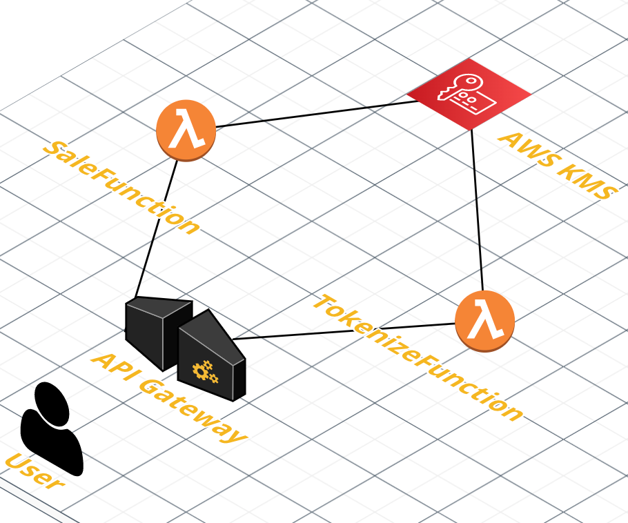

# primer-api

This project contains source code for the tokenise and sale endpoints for PrimerAPI.
It exposes two aws lambda functions and connects to BrainTree API to process a transaction.

- primer_api - Code for the application's Lambda functions (TokenizeFunction and SaleFunction).
- events - Invocation events to test functions invocation.
- tests - Unit tests for the application code. 
- template.yaml - A template that defines the application's AWS resources.
- swagger.yml - Swagger Template containing the documentation of the endpoints

The application uses several AWS resources, including Lambda functions and an API Gateway API. These resources are defined in the `template.yaml` file in this project. 

## Architecture



The application uses an aws API Gateway that invokes the 2 lambda functions:
- TokenizeFunction
- SaleFunction

Both functions need to connect to BrainTree:
- TokenizeFunction: In order to be used later, a generated token should be stored in BrainTree Vault. This is done using the BrainTree Customer Endpoint. The idea is to basically create a new customer for each provided credit card so that we can use it later to process transactions.
- SaleFunction: Here, we would need to submit a BrainTree [Transaction.sale()](https://developers.braintreepayments.com/reference/request/transaction/sale/python). We need to use the previousy stored token ans submit the request to BrainTree.

In order to initialise the BrainTree API, 3 keys are needed:
- merchant_id
- public_key
- private_key

These keys are stored as environment variables and are encrypted using aws KMS in order to be securely used from our lambda functions.

## Deploy the application

The Serverless Application Model Command Line Interface (SAM CLI) is an extension of the AWS CLI that adds functionality for building and testing Lambda applications. It uses Docker to run your functions in an Amazon Linux environment that matches Lambda. It can also emulate your application's build environment and API.

To use the SAM CLI, you need the following tools.

* SAM CLI - [Install the SAM CLI](https://docs.aws.amazon.com/serverless-application-model/latest/developerguide/serverless-sam-cli-install.html)
* [Python 3 installed](https://www.python.org/downloads/)
* Docker - [Install Docker community edition](https://hub.docker.com/search/?type=edition&offering=community)

To build and deploy the application for the first time, run the following in your shell:

```bash
sam build --use-container
sam deploy --guided
```

The first command will build the source of your application. The second command will package and deploy your application to AWS, with a series of prompts:

* **Stack Name**: The name of the stack to deploy to CloudFormation. This should be unique to your account and region, and a good starting point would be something matching your project name.
* **AWS Region**: The AWS region you want to deploy your app to.
* **Confirm changes before deploy**: If set to yes, any change sets will be shown to you before execution for manual review. If set to no, the AWS SAM CLI will automatically deploy application changes.
* **Allow SAM CLI IAM role creation**: Many AWS SAM templates, including this example, create AWS IAM roles required for the AWS Lambda function(s) included to access AWS services. By default, these are scoped down to minimum required permissions. To deploy an AWS CloudFormation stack which creates or modified IAM roles, the `CAPABILITY_IAM` value for `capabilities` must be provided. If permission isn't provided through this prompt, to deploy this example you must explicitly pass `--capabilities CAPABILITY_IAM` to the `sam deploy` command.
* **Save arguments to samconfig.toml**: If set to yes, your choices will be saved to a configuration file inside the project, so that in the future you can just re-run `sam deploy` without parameters to deploy changes to your application.

The API Gateway Endpoint URL will be displayed in the output values displayed after deployment.

## Use the SAM CLI to build and test locally

Build the application with the `sam build --use-container` command.

```bash
primer-api$ sam build --use-container
```

The SAM CLI installs dependencies defined in `primer_api/requirements.txt`, creates a deployment package, and saves it in the `.aws-sam/build` folder.


The SAM CLI can also emulate your application's API. Use the `sam local start-api` to run the API locally on port 3000.

```bash
primer-api$ sam local start-api
primer-api$ curl http://localhost:3000/
```

## Unit tests

Tests are defined in the `tests` folder in this project. Use PIP to install the [pytest](https://docs.pytest.org/en/latest/) and run unit tests.

```bash
primer-api$ pip install pytest pytest-mock --user
primer-api$ python -m pytest tests/ -v
```
